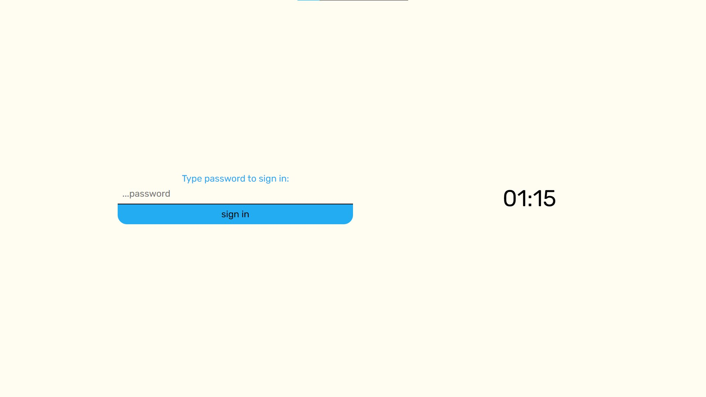
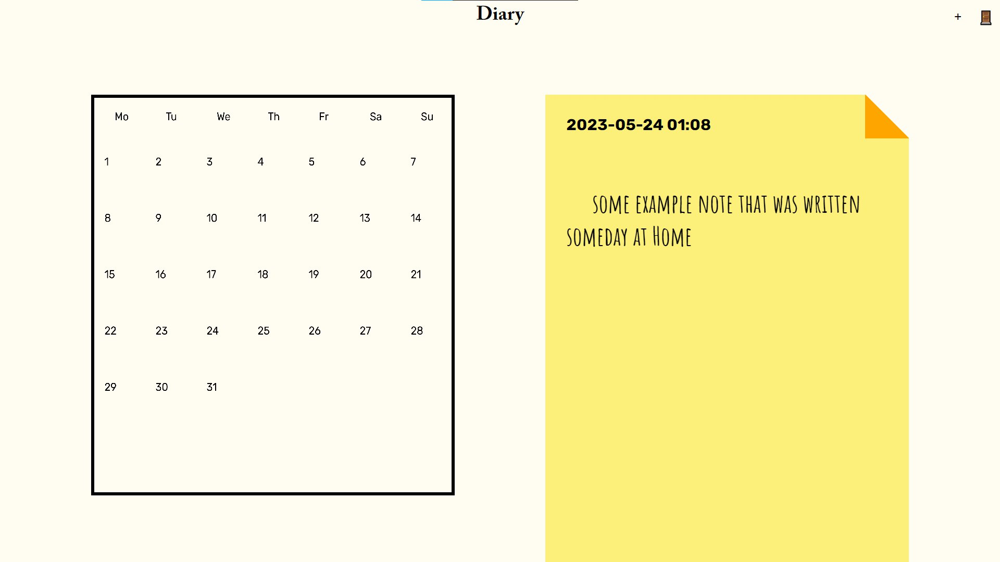
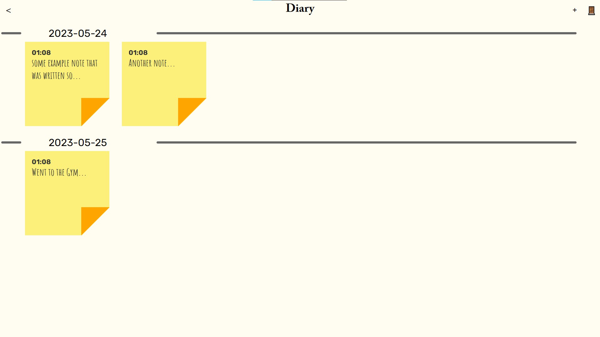
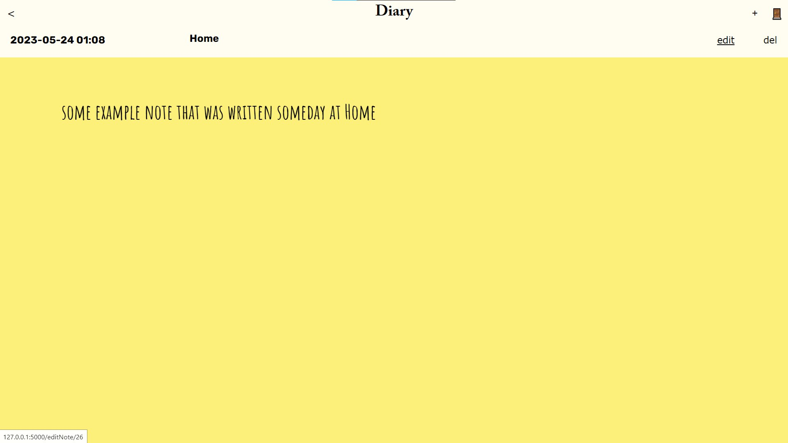

#Diary
this app is just a digital diary that consists of chronologically grouped notes
 
##Preview:
 

 

 

 

 

##How to set it up?
 
1. Clone this repo
2. connect server to your database
3. build web client with     yarn webpack build
6. install requirements from server/requirements.txt
4. run the server with flask     flask run
6. use it!

